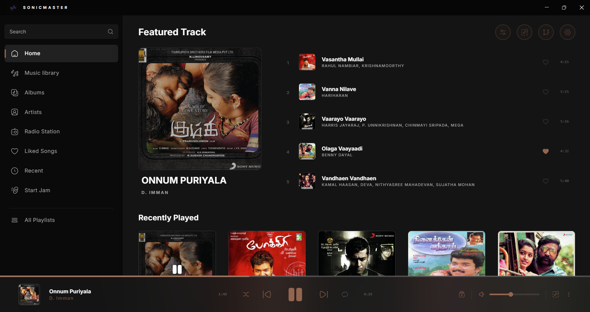
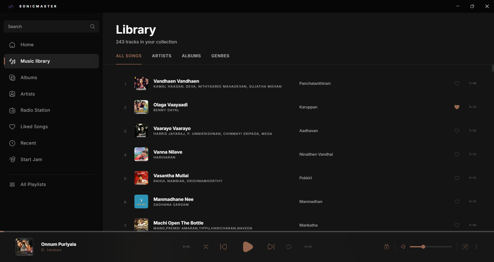
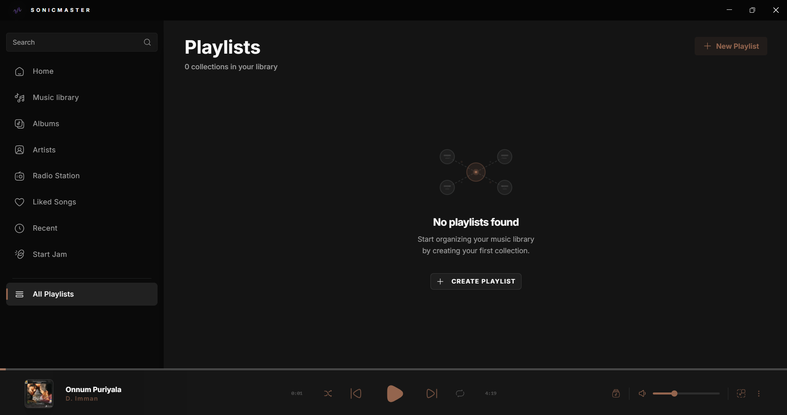
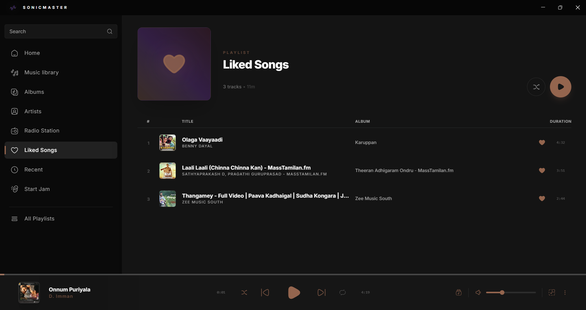
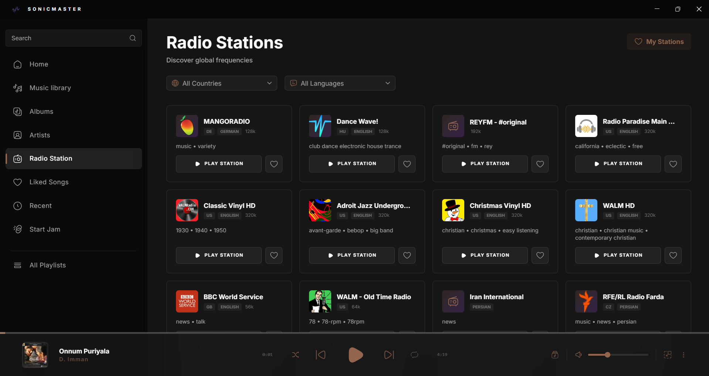
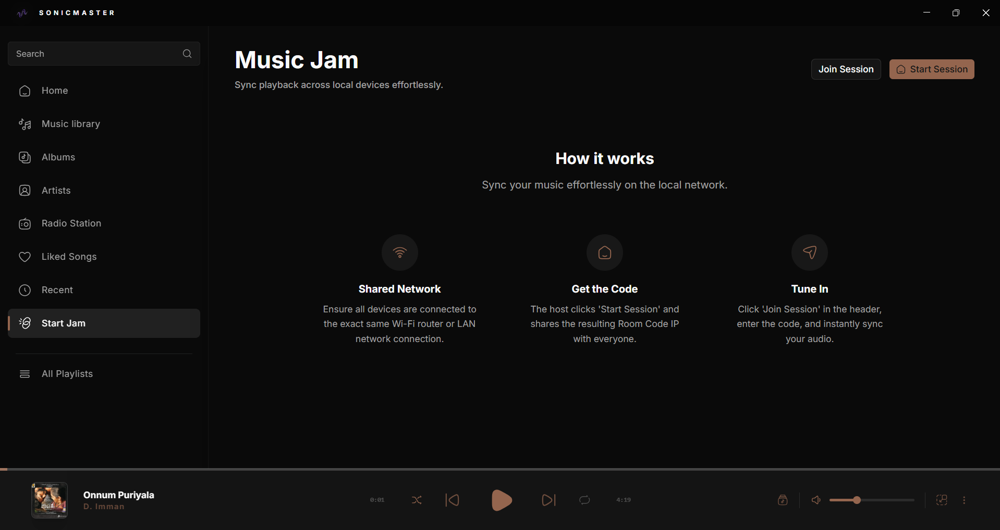
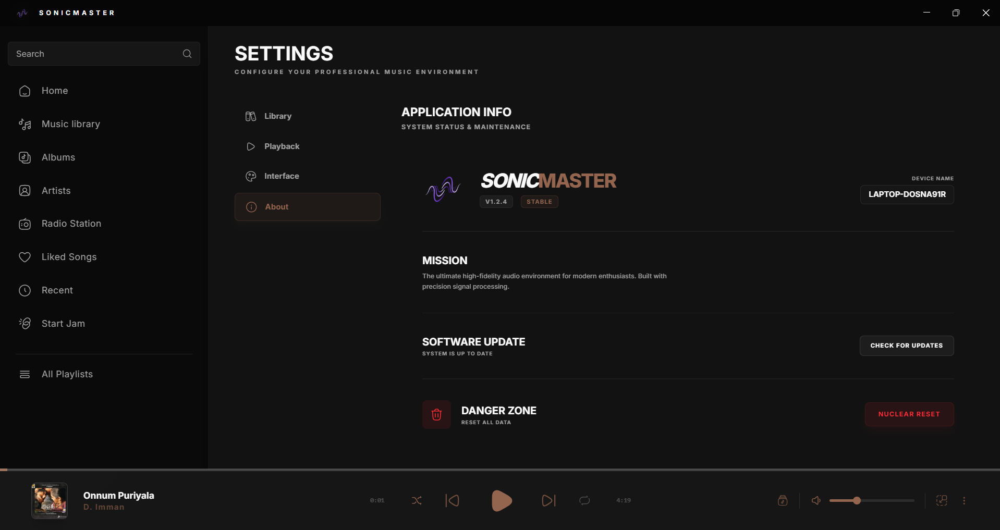

# SonicMaster

<div align="center">
  
  
  **The Ultimate High-Fidelity Audio Environment for Modern Enthusiasts**
  
  [](https://github.com/prasanth-t0205/sonicmaster)
  [](LICENSE)
  [](https://github.com/prasanth-t0205/sonicmaster)
</div>

---

## 📖 Table of Contents

- [Overview](#overview)
- [Changelog](#changelog)
- [Key Features](#key-features)
- [Screenshots](#screenshots)
- [Installation](#installation)
- [User Guide](#user-guide)
- [Technical Architecture](#technical-architecture)
- [Development](#development)
- [License](#license)

---

## 🎵 Overview

**SonicMaster** is a professional-grade desktop music player built with precision signal processing and modern web technologies. Designed for audiophiles and music enthusiasts, it combines powerful audio features with a stunning, customizable interface.

Built with **Electron**, **Vite**, and the **Web Audio API**, SonicMaster delivers a premium listening experience with advanced features like 10-band equalizer, audio calibration profiles, real-time visualizers, and seamless crossfade transitions.

---

## 📝 Changelog

### Version 1.0.0 (Initial Public Release)

- **Official Release**: SonicMaster 1.0.0 is officially live!
- **Core Engine**: Fully featured web audio DSP pipeline with 10-band EQ, Psychoacoustic Bass, and Reverb.
- **Library Management**: Intelligent local file scanning, automated metadata extraction, and custom playlists.
- **Collaborative Listening**: Seamless real-time Jam Sessions across your Local Area Network.
- **Modern UI**: Completely overhauled minimal, flat aesthetic utilizing React 19, Vite, and Tailwind CSS.

---

## ✨ Key Features

### 🎧 Audio Engine

- **Advanced Web Audio Processing**
  - **Professional DSP Studio Rack** (Reverb, Spatial 3D, Sonic Bass, Vocal Focus)
  - 10-band parametric equalizer (60Hz - 16kHz)
  - Dynamic range compression for consistent volume
  - Hardware output calibration profiles (Standard, Acoustic Clarity, Bass Enhanced, Vocal Boost)
  - Bit-perfect mode for direct DAC output
  - Mono audio and stereo balance controls
  - Individual L/R channel hearing toggles
  - Volume normalization across tracks

- **Playback Features**
  - Gapless playback with crossfade transitions (0-12 seconds)
  - Variable playback speed (0.5x - 3.0x) with pitch preservation
  - Advanced Shuffle Modes: Standard (Fisher-Yates), Smart, Weighted, and Genre-Based
  - Repeat modes (None, One, All)
  - A-B Repeat: Loop specific sections of a song with precise points
  - Fade In/Out: Smooth volume transitions on play/pause
  - Party Mode: Password-protected playback controls
  - Replay Gain: Automatic loudness normalization
  - Auto-advance and stop-after-current options
  - Resume playback from last position
  - Sleep timer functionality
  - Instant file opening from double-click with full-screen view

- **Format Support**
  - MP3, WAV, FLAC, OGG, M4A, AAC, WMA
  - HLS streaming support for radio stations
  - Embedded album art extraction
  - ID3 tag metadata parsing

### 📻 Radio Integration

- **Internet Radio**
  - Access to thousands of global radio stations via Radio Browser API
  - Filter by country, language, and genre
  - Infinite scroll with smart pagination
  - Favorite stations management
  - HLS stream support with automatic fallback

### 📚 Library Management

- **Smart Organization**
  - Browse by Artists, Albums, Genres, or All Songs
  - Recently played tracks with history tracking
  - Liked songs collection with favorites system
  - Play count tracking and statistics
  - Auto-scan on startup option
  - Multiple folder sources support

- **Playlist Management**
  - Create custom playlists with name and description
  - Add/remove songs from playlists
  - Pin favorite playlists for quick access
  - Edit playlist details (name, description)
  - View playlist information (song count, duration)
  - Delete playlists with confirmation
  - Context menu for quick actions
  - Grid view with visual playlist cards

- **Metadata Editor & Lyrics Sync Studio**
  - **ID3 Tag Editing**: Edit title, artist, album, album artist, genre, year
  - **Album Art Management**: Upload, replace, or download embedded cover art
  - **Lyrics Editor**: Create and edit synchronized LRC lyrics
  - **Waveform Visualizer**: Real-time audio waveform with zoom controls
  - **Time Stamping**: Automatic timestamp insertion (Ctrl+Space)
  - **Karaoke Mode**: Live lyrics sync with auto-scroll and highlighting
  - **Fine-Tuning**: Adjust timestamps by ±0.1s with bracket keys
  - **Import/Export**: Load and save .lrc files
  - **Playback Speed Control**: 0.5x to 2.0x for easier syncing
  - **Visual Timeline**: Lyric bookmarks displayed on waveform
  - **Keyboard Shortcuts**: Full keyboard navigation for efficient editing

- **Search & Filter**
  - Real-time search across title, artist, and album
  - Sort by: Default, A-Z, Z-A, Newest, Oldest
  - Debounced search for optimal performance
  - Filter exclusion rules (small files, short tracks)

### 🎨 Visual Experience

- **Customizable Interface**
  - Dark and Light theme modes
  - Dynamic accent color with HSL customization
  - Album art-based color sync
  - Ambient backdrop with blurred album art
  - Layout density options (Comfy, Compact)
  - Chromatic customization with hue, intensity, and luminance controls

- **Music Visualizers**
  - 9 visualizer modes: Bars, Line, Circle, Pulse, Radial, Mirrored Bars, Kinetic Rain, Silk Wave, DJ Mode
  - DJ Mode with rainbow spectrum colors and album art sync
  - Real-time frequency analysis with high-resolution spectral data
  - Full-screen visualization support with live animated previews

- **Now Playing Views**
  - Full-screen Now Playing interface
  - Mini player mode (520x200, always-on-top)
  - Queue management with drag-and-drop
  - Lyrics display support
  - Desktop notifications for track changes

### 🎛️ Advanced Controls

- **Equalizer**
  - Professional 10-band parametric EQ
  - Preset system (Manual, Rock, Pop, Jazz, Classical, etc.)
  - Real-time frequency adjustment (-12dB to +12dB)
  - Visual feedback with dB grid lines
  - Enable/bypass toggle

- **Audio Profiles**
  - Standard (Balanced, no processing)
  - Acoustic Clarity (Enhanced highs for laptops)
  - Bass Enhanced (Deep lows for external speakers)
  - Vocal Boost (Crystal clear mids for speech)

### 🔧 Settings & Configuration

- **Library Settings**
  - Multiple scan path management
  - Manual and automatic library scanning
  - Library statistics (songs, artists, albums)
  - Database refresh and optimization

- **Playback Settings**
  - Output device selection
  - Crossfade duration control
  - Tempo control (playback speed)
  - Audio quality modes (Balanced, High)
  - Pre-fetch next track for zero-latency
  - Low latency mode toggle

- **Interface Settings**
  - Theme appearance customization
  - Visualizer mode selection
  - Auxiliary panel (right sidebar) toggle
  - Desktop notifications control
  - Full-screen art display options

- **System**
  - Auto-update functionality
  - Database reset option
  - Set as default music player
  - App version and system info

### 🎯 Additional Features

- **Jam Session** (Collaborative Listening)
  - Host or join listening sessions on your Local Area Network (LAN)
  - Real-time playback synchronization
  - Shared queue and controls
  - WebSocket-based direct local connection (No internet required)

- **Keyboard Shortcuts**
  - Space: Play/Pause
  - Arrow keys: Seek, Volume
  - Media keys support
  - Custom hotkey bindings

- **Windows Integration**
  - Taskbar thumbnail controls (Previous, Play/Pause, Next)
  - File association for audio formats
  - Native title bar with custom overlay
  - System tray integration

---

## 📸 Screenshots

### Home Dashboard


_The main interface featuring the currently playing track, search functionality, and recently played songs._

### Library View


_Browse your entire music collection organized by songs, artists, albums, or genres._

### Playlists


_Manage and organize your custom playlists seamlessly._

### Liked Songs


_Your favorite tracks, all in one place._

### Radio Stations


_Discover and play thousands of internet radio stations from around the world._

### Jam Sessions


_Collaborative real-time listening over your Local Area Network._

### Settings


_Comprehensive settings for audio, interface, library, and system configuration._

---

## 💿 Installation

### Prerequisites

- **Node.js** 18.x or higher
- **npm** or **yarn** package manager
- **Windows 10/11** or **Linux**

### Download

1. **Pre-built Binaries** (Recommended)
   - Download the latest release from [Releases](https://github.com/prasanth-t0205/sonicmaster/releases)
   - Run the installer for your platform
   - Launch SonicMaster

2. **Build from Source**

```bash
# Clone the repository
git clone https://github.com/prasanth-t0205/sonicmaster.git
cd sonicmaster

# Install dependencies
npm install

# Development mode
npm run electron:dev

# Build for production
npm run electron:build
```

### First Launch

1. **Add Music Folders**
   - Go to Settings → Library
   - Click "Add Folder"
   - Select your music directory
   - Click "Scan Now" to index your library

2. **Configure Audio**
   - Go to Settings → Playback
   - Select your preferred output device
   - Adjust equalizer and audio profile
   - Set crossfade and playback preferences

3. **Customize Interface**
   - Go to Settings → Interface
   - Choose your theme (Dark/Light)
   - Select accent color or enable dynamic sync
   - Configure visualizer preferences

---

## 📖 User Guide

### Navigation

#### Main Pages

- **Home** (`/`) - Dashboard with featured track and recently played
- **Library** (`/library`) - Browse all songs, artists, albums, genres
- **Recent** (`/recent`) - Recently played tracks
- **Liked** (`/liked`) - Your favorite songs
- **Radio** (`/radio`) - Internet radio stations
- **Equalizer** (`/equalizer`) - 10-band EQ controls
- **Edit** (`/edit`) - Metadata editor and lyrics sync studio
- **Settings** (`/settings`) - Application configuration

#### Library Sub-Pages

- **Artist View** (`/library/artist?name=...`) - All songs by an artist
- **Album View** (`/library/album?name=...`) - All songs in an album
- **Genre View** (`/library/genre?name=...`) - All songs in a genre

### Playback Controls

#### Player Bar (Bottom)

- **Progress Bar** - Click or drag to seek
- **Album Art** - Click to open full-screen view
- **Play/Pause** - Toggle playback
- **Previous/Next** - Navigate tracks
- **Shuffle** - Randomize playback order
- **Repeat** - Cycle through None → All → One
- **Volume** - Adjust output level
- **Queue** - View and manage upcoming tracks
- **Mini Player** - Switch to compact mode
- **Track Menu** - Additional options (Add to playlist, Show in folder, etc.)

### Song Actions

Right-click or click the menu icon on any song to:

- **Play Now** - Start playing immediately
- **Add to Queue** - Add to end of current queue
- **Play Next** - Insert after current song
- **Add to Playlist** - Save to a playlist
- **Like/Unlike** - Toggle favorite status
- **Edit Metadata** - Open metadata editor and lyrics sync studio
- **Show in Folder** - Open file location
- **Delete from Library** - Remove permanently

### Equalizer Usage

1. Navigate to **Equalizer** page
2. Toggle **Active/Bypassed** switch
3. Select a **Preset** or use **Manual** mode
4. Adjust individual frequency bands:
   - 60Hz, 170Hz, 310Hz, 600Hz, 1kHz, 3kHz, 6kHz, 12kHz, 14kHz, 16kHz
   - Range: -12dB to +12dB
5. Changes apply in real-time

### Metadata Editor & Lyrics Sync Studio

**Accessing the Editor:**

1. Right-click any song → **Edit Metadata**
2. Or use the track menu icon → **Edit Metadata**

**Editing Song Information:**

1. **Album Art**: Click the cover art to upload a new image
   - Supports JPG, PNG, WebP formats
   - Click the download icon to save embedded art
2. **Metadata Fields**: Edit title, artist, album, album artist, genre, year
3. Click **Save Changes** to write to file

**Creating Synchronized Lyrics (LRC):**

**Method 1: Manual Time Stamping**

1. Load a song in the editor
2. Click **Play** to start playback
3. Press **Ctrl+Space** at each lyric line to insert timestamp
4. Type the lyric text after the timestamp
5. Format: `[mm:ss.xx] Lyric text`

**Method 2: Karaoke Mode (Live Sync)**

1. Paste plain lyrics into the editor
2. Add timestamps manually: `[00:12.50] First line`
3. Click **Karaoke** mode toggle
4. Click **Play** to preview
5. Click any lyric line to jump to that timestamp
6. Use **[ ]** keys to fine-tune timing (±0.1s)
7. Active line highlights and auto-scrolls

**Waveform Features:**

- **Visual Timeline**: See audio waveform with lyric bookmarks
- **Zoom Controls**: Ctrl + Plus/Minus or toolbar buttons
- **Click to Seek**: Click anywhere on waveform to jump
- **Hover Preview**: Hover to see timestamp
- **Auto-Scroll**: Waveform follows playback in real-time

**Import/Export:**

- **Import**: Click upload icon → Select .lrc or .txt file
- **Export**: Click download icon → Save as .lrc file
- **Standalone Mode**: Open .lrc file without audio, then select audio to sync

**Playback Speed Control:**

- Adjust speed from 0.5x to 2.0x
- Useful for fast-paced songs or detailed syncing
- Speed selector in toolbar

**Keyboard Shortcuts (Editor):**

- `Ctrl+Space` - Insert timestamp at current position
- `Shift+Space` - Play/Pause
- `←/→` - Seek backward/forward 5 seconds
- `Shift+←/→` - Seek backward/forward 1 second
- `[` - Shift active timestamp -0.1s
- `]` - Shift active timestamp +0.1s
- `Ctrl+S` - Save changes
- `Ctrl+Plus/Minus` - Zoom in/out waveform
- `?` - Show keyboard shortcuts

**Tips:**

- Use **Karaoke Mode** to preview your synced lyrics
- Fine-tune timestamps using bracket keys for precision
- Zoom in on waveform for accurate timing
- Export lyrics to share or backup
- Playback speed helps with rapid-fire lyrics

### Radio Stations

1. Navigate to **Radio** page
2. Use filters:
   - **Search** - Find stations by name
   - **Country** - Filter by location
   - **Language** - Filter by broadcast language
3. Click a station card to start streaming
4. Click the heart icon to save to **My Stations**

### Jam Session (Collaborative Listening)

**Host a Session:**

1. Click the Jam icon in the sidebar
2. Click "Start Session" in the header
3. Share the generated Room Code (IP address and port) with friends on your local network

**Join a Session:**

1. Click the Jam icon
2. Click "Join Session" in the header
3. Enter the host's Room Code / IP address
4. Click "Connect"

**Features:**

- Synchronized playback across all participants
- Host controls playback for everyone
- Real-time progress synchronization
- Shared queue visibility

### Keyboard Shortcuts

| Action             | Shortcut   |
| ------------------ | ---------- |
| Play/Pause         | `Space`    |
| Next Track         | `Ctrl + →` |
| Previous Track     | `Ctrl + ←` |
| Volume Up          | `↑`        |
| Volume Down        | `↓`        |
| Seek Forward       | `→`        |
| Seek Backward      | `←`        |
| Toggle Shuffle     | `Ctrl + S` |
| Toggle Repeat      | `Ctrl + R` |
| Open Search        | `Ctrl + F` |
| Toggle Full Screen | `F11`      |

---

## 🏗️ Technical Architecture

### Technology Stack

#### Frontend

- **Vite 8** - Lightning fast frontend tooling
- **React 19** - UI library with React Router DOM for SPA routing
- **TypeScript** - Type-safe development
- **Tailwind CSS v4** - Utility-first styling with Vite integration
- **Shadcn UI** - Accessible component primitives
- **Hugeicons** - Icon library

#### Desktop

- **Electron 42** - Cross-platform desktop framework
- **electron-builder** - Application packaging
- **Inno Setup 6** - Windows installer generation
- **electron-updater** - Auto-update functionality
- **javascript-obfuscator** - Production code security

#### Audio

- **Web Audio API** - Advanced audio processing
- **HLS.js** - HTTP Live Streaming support
- **music-metadata** - Audio file metadata extraction

#### Database

- **better-sqlite3** - Embedded SQL database
- Stores: songs, favorites, playlists, settings, history, play counts

#### Networking

- **Socket.io** - Real-time LAN websocket connections (Jam sessions)
- **Radio Browser API** - Internet radio station directory

### Project Structure

```
sonicmaster/
├── src/                     # React Vite Application Source
│   ├── components/          # React components (Modularized)
│   │   ├── common/          # Reusable UI parts (modals, prompts)
│   │   ├── layout/          # Structural components (sidebar, titlebar)
│   │   ├── player/          # Playback components (controls, full screen)
│   │   ├── library/         # Library specific components
│   │   ├── dialogs/         # Modal dialogs
│   │   ├── settings/        # Settings panels
│   │   └── ui/              # Shadcn UI primitives
│   ├── context/             # React Context providers
│   ├── hooks/               # Custom React hooks
│   ├── lib/                 # Utility functions & navigation
│   ├── pages/               # React Router page components
│   │   ├── home.tsx         # Home dashboard
│   │   ├── library.tsx      # Library view
│   │   ├── settings.tsx     # Settings page
│   │   ├── jam.tsx          # Jam sessions
│   │   └── ...
│   ├── App.tsx              # Router & Context Provider root
│   ├── main.tsx             # React DOM mount point
│   └── globals.css          # Tailwind CSS global styles
├── electron/                # Electron Main Process
│   ├── main.ts              # Main entry point
│   ├── preload.cjs          # Preload script
│   ├── database.ts          # SQLite operations
│   └── ipc/                 # IPC handlers
│       └── music.ts         # Music file operations
└── public/                  # Static assets (Icon, app screenshots)
```

### Audio Processing Pipeline

```
Audio File → HTMLAudioElement → MediaElementSource
                                        ↓
                                  Gain Node (Track 1)
                                        ↓
                                  10-Band EQ Chain
                                        ↓
                             ┌─── Psychoacoustic Bass
                             ├─── Reverb (Convolution)
                             └─── Center Vocal Focus
                                        ↓
                             L/R Channel Isolation Stage
                                        ↓
                                  Spatial 3D (HRTF)
                                        ↓
                                  Stereo Panner Node
                                        ↓
                                  Dynamics Compressor
                                        ↓
                                  Master Gain
                                        ↓
                                  Analyser Node → Visualizer
                                        ↓
                                  Audio Destination (Speakers)
                                        ↓
                                  MediaStream Destination (Jam Broadcast)
```

### Database Schema

**songs**

- path (PRIMARY KEY)
- title, artist, album, albumArtist
- duration, hasArt, mtime
- genre (JSON), year, bitrate, format

**favorites**

- path (PRIMARY KEY)

**playlists**

- id, name, description, isPinned, createdAt

**playlist_songs**

- playlistId, songPath, position

**settings**

- key (PRIMARY KEY), value (JSON)

**history**

- path, playedAt

**play_counts**

- path, count

### State Management

- **AudioContext** - Playback state, queue, volume, EQ settings
- **SettingsContext** - User preferences, theme, audio config
- **MusicLibraryContext** - Song library, scanning, metadata
- **JamContext** - Peer connections, session state
- **NowPlayingContext** - Full-screen view, queue visibility

### IPC Communication

**Main → Renderer**

- `play-file` - Open file from OS
- `media-control` - Taskbar button actions
- `updater-event` - Update progress
- `mini-mode-maximize` - Restore from mini mode

**Renderer → Main**

- `window-minimize/maximize/close` - Window controls
- `set-mini-mode` - Toggle mini player
- `update-titlebar-theme` - Theme changes
- `update-thumbar` - Update taskbar buttons
- `db-*` - Database operations
- `scan-music-folder` - Library scanning
- `get-album-art` - Extract cover art
- `delete-song` - File deletion

---

## 🛠️ Development

### Setup Development Environment

```bash
# Install dependencies
npm install

# Start Vite dev server and Electron
npm run dev
```

### Build Commands

```bash
# Build for production (Windows)
npm run build

# Build for Linux
npm run publish:linux
```

### Code Style

- **ESLint** - Linting
- **Prettier** - Code formatting
- **Husky & Lint-Staged** - Pre-commit hooks

```bash
# Format and lint code automatically
npm run lint
```

### Testing

```bash
# Run tests
npm test

# Run tests in watch mode
npm run test:watch
```

### Debugging

**Renderer Process:**

- Open DevTools: `Ctrl + Shift + I`
- Console logs appear in DevTools

**Main Process:**

- Logs appear in terminal running `npm run electron:dev`
- Use `console.log()` in `electron/main.ts`

**Preload Script:**

- Logs appear in renderer DevTools console
- Use `console.log()` in `electron/preload.cjs`

---

## 🤝 Contributing

SonicMaster is currently in its v1.0.0 launch phase. To maintain our strict, premium UI/UX design standards and ensure absolute core stability, we are currently operating under a **Bug-Fixes Only** contribution model.

- **Found a bug or crash?** We'd love your help! Please open an Issue using the Bug Report template, or submit a Pull Request with the code fix.
- **Have a feature idea or UI change?** Thank you for your enthusiasm! However, we are currently **NOT** accepting Feature Requests or Pull Requests that introduce new functionality, UI changes, or design alterations. Any such PRs will be politely closed to protect the vision of the application.

Please read our full [Contributing Guidelines](CONTRIBUTING.md) for more details.

---

## 📝 License

This project is licensed under the **MIT License** - see the [LICENSE](LICENSE) file for details.

---

## 🙏 Acknowledgments

- **Vite** - React framework
- **Electron** - Desktop application framework
- **Web Audio API** - Audio processing
- **Radio Browser** - Radio station directory
- **Hugeicons** - Icon library
- **Radix UI** - Component primitives

---

## 📧 Contact

For questions, suggestions, or issues:

- **GitHub Issues**: [Create an issue](https://github.com/prasanth-t0205/sonicmaster/issues)
- **Email**: offcial@prefenzotechnologies.com
- **Twitter**: [@prasanth-t0205](https://twitter.com/prasanth-t0205)

---

<div align="center">
  <p>Made with ❤️ by music enthusiasts, for music enthusiasts</p>
  <p>© 2026 SonicMaster. All rights reserved.</p>
</div>
